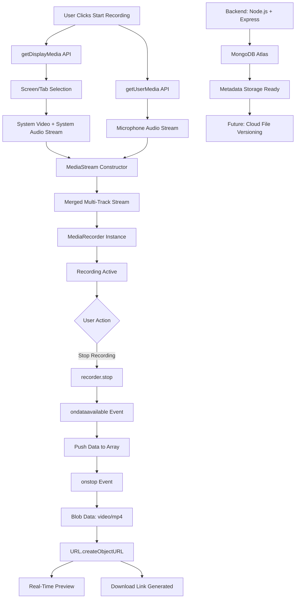

# 🎥 Browser-Based Media Capture System

An efficient, plugin-free screen recording application engineered with the MediaRecorder API. This system features a multi-track stream merger for synchronized video/audio capture, secure Blob-storage workflow, and a backend foundation for metadata management and cloud-based file versioning.

[](https://sriram629.github.io/Screen_Recorder/)
[](https://github.com/sriram629/Screen_Recorder/actions)

---

## 🎯 The "Why"

Traditional screen recording tools require bulky software installations or third-party plugins. **Browser-Based Media Capture System** eliminates these dependencies by leveraging native browser APIs, providing instant high-quality recording with synchronized audio streams, zero-latency preview, and secure local file handling—all without leaving the browser.

---

## ✨ Key Features

### 🎬 Screen Recording Engine
* **MediaRecorder API Integration:** High-quality video and audio capture without third-party plugins
* **Flexible Capture Options:** Record entire screen, specific window, or browser tab
* **Display Media API:** Native `getDisplayMedia()` implementation for system-level screen access
* **Plugin-Free Architecture:** No external dependencies required—works entirely in modern browsers

### 🎙️ Multi-Track Stream Merger
* **Synchronized Capture:** Combines system video with microphone audio seamlessly
* **1:1 Playback Alignment:** Achieves perfect synchronization between video and audio tracks
* **Dual Stream Processing:** Merges `getDisplayMedia()` (screen/system audio) with `getUserMedia()` (microphone)
* **MediaStream Constructor:** Uses `new MediaStream([...videoTracks, ...audioTracks])` for unified stream handling

### 💾 Secure Blob-Storage Workflow
* **Local Data Handling:** Client-side Blob conversion for secure, private recording storage
* **Instant Download:** Automatic export as MP4 video files with zero server dependency
* **Zero-Latency Preview:** Real-time playback via `URL.createObjectURL()` without upload delays
* **Efficient Memory Management:** Blob data stored temporarily in browser memory for immediate access

### 🖥️ Real-Time Interface
* **Live Preview:** View recording stream in real-time during capture
* **Start/Stop Controls:** Simple button interface for recording management
* **Playback Controls:** Built-in HTML5 video player with standard controls
* **Download Button:** One-click download with custom filename support

### 🏗️ Backend Foundation
* **Node.js + Express:** RESTful API architecture for future expansion
* **MongoDB Atlas:** Database integration for metadata management
* **Cloud-Ready Infrastructure:** Prepared for cloud-based file versioning and user management
* **Scalable Design:** Foundation built for multi-user recording history and cloud storage

---

## 🛠️ Tech Stack

### Frontend
* **Languages:** HTML5, CSS3, Vanilla JavaScript
* **Browser APIs:**
  - [MediaStream Recording API](https://developer.mozilla.org/en-US/docs/Web/API/MediaStream_Recording_API)
  - [Screen Capture API (getDisplayMedia)](https://developer.mozilla.org/en-US/docs/Web/API/Screen_Capture_API)
  - [getUserMedia API](https://developer.mozilla.org/en-US/docs/Web/API/MediaDevices/getUserMedia)
* **Deployment:** GitHub Pages with CI/CD

### Backend
* **Runtime:** Node.js
* **Framework:** Express.js
* **Database:** MongoDB Atlas (Mongoose ODM)
* **CORS:** Cross-Origin Resource Sharing enabled
* **Future Ready:** Metadata storage and file versioning architecture

---

## 🔄 Technical Architecture



---

## 🚀 Getting Started

### Prerequisites

* **Modern Web Browser:** Chrome, Edge, or Firefox (with Screen Capture API support)
* **Node.js 14+** (for backend development)
* **MongoDB Atlas Account** (optional, for database features)

### Installation

#### 1. Clone the Repository

```bash
git clone https://github.com/sriram629/Screen_Recorder.git
cd Screen_Recorder
```

#### 2. Run the Frontend

**Option A: Direct Browser Access**
```bash
cd frontend
# Open index.html in your browser
```

**Option B: Live Server (VS Code)**
```bash
# Install Live Server extension
# Right-click index.html → Open with Live Server
```

**Option C: Local HTTP Server**
```bash
cd frontend
python -m http.server 8080
# Visit http://localhost:8080
```

#### 3. Run the Backend (Optional)

```bash
cd backend
npm install
npm start
```

The backend server will run on **http://localhost:8000**

---

## 📂 Repository Structure

```text
screen-recorder/
├── .github/workflows/       # CI/CD (GitHub Actions)
│   └── static.yml          # Auto-deployment configuration
│
├── frontend/                # Client-side (Deployed to GitHub Pages)
│   ├── index.html          # Main Entry Point
│   ├── screen.css          # Styling & UI Layout
│   └── screen.js           # MediaRecorder API Logic
│       ├── getDisplayMedia()    # Screen capture
│       ├── getUserMedia()       # Microphone capture
│       ├── MediaStream()        # Stream merger
│       ├── MediaRecorder()      # Recording engine
│       └── Blob handling        # Download workflow
│
├── backend/                 # Server-side (Node.js + Express)
│   ├── server.js           # Express app configuration
│   ├── package.json        # Backend dependencies
│   └── [future routes]     # API endpoints for metadata
│
└── README.md                # Project Documentation
```

---

## 💻 Core Implementation

### Multi-Track Stream Merger

The heart of the system combines two separate media streams into a single synchronized recording:

```javascript
// Step 1: Capture screen with system audio
var recording = navigator.mediaDevices.getDisplayMedia({
    video: { mediaSource: 'screen' },
    audio: true  // System audio
});

// Step 2: Capture microphone audio separately
let audio = await navigator.mediaDevices.getUserMedia({
    audio: true, 
    video: false
});

// Step 3: Merge both streams using MediaStream constructor
let combine = new MediaStream([
    ...e.getTracks(),      // Screen video + system audio tracks
    ...audio.getTracks()   // Microphone audio track
]);

// Step 4: Create unified recorder
let recorder = new MediaRecorder(combine);
```

### Blob-Storage Workflow

Secure, client-side recording management without server uploads:

```javascript
var data = [];  // Array to store recording chunks

// Collect data as it becomes available
recorder.ondataavailable = (e) => {
    data.push(e.data);
};

// Process recording when stopped
recorder.onstop = () => {
    // Convert chunks to single MP4 Blob
    let blobData = new Blob(data, { type: 'video/mp4' });
    
    // Create temporary browser URL
    let url = URL.createObjectURL(blobData);
    
    // Enable instant preview and download
    output.src = url;      // Video preview
    anc.href = url;        // Download link
};
```

### Backend Foundation

MongoDB Atlas integration for future metadata management:

```javascript
const express = require("express");
const mongoose = require('mongoose');
const cors = require("cors");

const app = express();
app.use(cors());

// Database connection
const DB = async () => {
    await mongoose.connect('mongodb+srv://...');
    console.log("Connected to database...");
};
DB();

// Future: Metadata storage endpoints
app.get('/', (req, res) => {
    res.send("Media Capture Backend Ready");
});

app.listen(8000);
```

---

## 🎮 How to Use

### Step 1: Grant Permissions
1. Click **"Start Recording"** button
2. Browser prompts for screen sharing permission
3. Select **Entire Screen**, **Window**, or **Tab**
4. Allow microphone access when prompted

### Step 2: Record
* Real-time preview appears in the interface
* System video and microphone audio are synchronized automatically
* Recording indicator shows active capture

### Step 3: Stop & Save
1. Click **"Stop Recording"** when finished
2. Preview video plays automatically with full audio
3. Click **"Download"** to save as `output.mp4`

---

## 🌐 Deployment (CI/CD)

This project uses **GitHub Actions** for automated deployment to GitHub Pages.

### Workflow Configuration

**File:** `.github/workflows/static.yml`

```yaml
name: Deploy Frontend

on:
  push:
    branches: ["master"]

jobs:
  deploy:
    runs-on: ubuntu-latest
    steps:
      - name: Checkout
        uses: actions/checkout@v3
      
      - name: Deploy to GitHub Pages
        uses: peaceiris/actions-gh-pages@v3
        with:
          github_token: ${{ secrets.GITHUB_TOKEN }}
          publish_dir: ./frontend
```

### Deployment Process
* **Trigger:** Every push to `master` branch
* **Build Path:** Only `./frontend` directory is uploaded
* **Entry Point:** `index.html` serves as root
* **Live URL:** https://sriram629.github.io/Screen_Recorder/

---

## 🔧 Browser Compatibility

| Feature | Chrome | Edge | Firefox | Safari |
|:---|:---:|:---:|:---:|:---:|
| **getDisplayMedia** | ✅ | ✅ | ✅ | ⚠️ Limited |
| **MediaRecorder** | ✅ | ✅ | ✅ | ✅ |
| **System Audio** | ✅ | ✅ | ❌ | ❌ |
| **Microphone** | ✅ | ✅ | ✅ | ✅ |

**Recommended:** Chrome or Edge for full feature support including system audio capture.

---

## 🚀 Performance Metrics

| Feature | Performance | Technical Detail |
|:---|:---|:---|
| **Stream Synchronization** | 1:1 Alignment | MediaStream constructor merges tracks |
| **Preview Latency** | Zero-latency | Client-side Blob URL generation |
| **Download Speed** | Instant | No server upload required |
| **Recording Quality** | High-quality MP4 | Native MediaRecorder encoding |
| **Memory Usage** | Efficient | Blob cleanup after download |

---

## 🔮 Future Enhancements

### Planned Backend Features
- [ ] **User Authentication:** Secure login system
- [ ] **Recording History:** Database-backed recording metadata
- [ ] **Cloud Storage:** Upload recordings to cloud (AWS S3/Google Cloud)
- [ ] **File Versioning:** Track multiple versions of recordings
- [ ] **Sharing:** Generate shareable links for recordings
- [ ] **Transcription:** Automatic speech-to-text using AI APIs

### Frontend Improvements
- [ ] **Pause/Resume:** Mid-recording pause functionality
- [ ] **Video Trimming:** Basic editing capabilities
- [ ] **Custom Quality Settings:** Bitrate and resolution options
- [ ] **Annotations:** Draw on screen during recording
- [ ] **Webcam Overlay:** Picture-in-picture webcam support

---

## 🎓 Use Cases

### For Educators
* Record lectures and tutorials
* Create instructional videos
* Demonstrate software workflows

### For Developers
* Record bug reproductions
* Create coding tutorials
* Document application features

### For Content Creators
* Capture gameplay footage
* Record webinars and presentations
* Create screen-based content

---

## 🤝 Contributing

Contributions are welcome! Please feel free to submit a Pull Request.

---

## 📝 License

This project is open source and available under the MIT License.

---

## 🔗 Links

- **Live Demo:** [sriram629.github.io/Screen_Recorder](https://sriram629.github.io/Screen_Recorder/)
- **GitHub Actions Status:** [View Workflows](https://github.com/sriram629/Screen_Recorder/actions)
- **Report Issues:** [GitHub Issues](https://github.com/sriram629/Screen_Recorder/issues)

---

## 🙏 Acknowledgments

- [MDN Web Docs](https://developer.mozilla.org/) for comprehensive API documentation
- [MediaRecorder API](https://developer.mozilla.org/en-US/docs/Web/API/MediaRecorder) specification
- [Screen Capture API](https://developer.mozilla.org/en-US/docs/Web/API/Screen_Capture_API) implementation guide

---

**Built with ❤️ using Vanilla JavaScript and Browser APIs**
